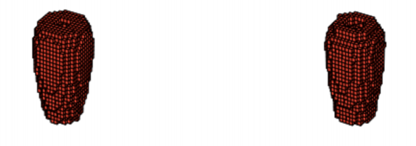
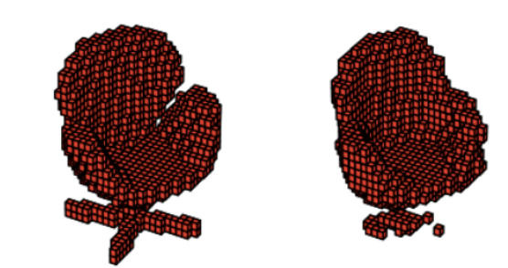
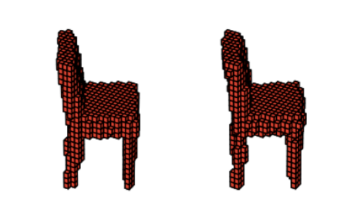

# Generative-3D-Compression
Neural network model for compressing 3D volumetric objects

The network consists of 3 parts

# 3D GAN
Generative Adversarial Network for generating 3D Volumetric object

run `3DGAN.py` to train the GAN
 
# VoxNet
3D Volumetric Object classifier

run `VoxNet.py` to train VoxNet

# Generative 3D Compression Network
A 3D Convolutional NN autoencoder which utilizes the generator part of the 3D GAN to bootstrap the training of the decoder network. Object and reconstructed object of the compressor network are feed into the VoxNet. The difference in the "perception" of the VoxNet is used as a part of the loss function. 

run `compress-gen.py` to train the compressor network. Trained 3D GAN and VoxNet are required.

Below are some of the objects compressed by 165 times the size (left = original, right = compressed and reconstructed),

